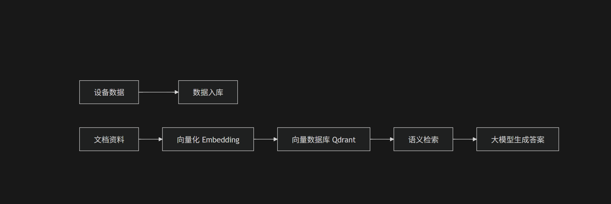
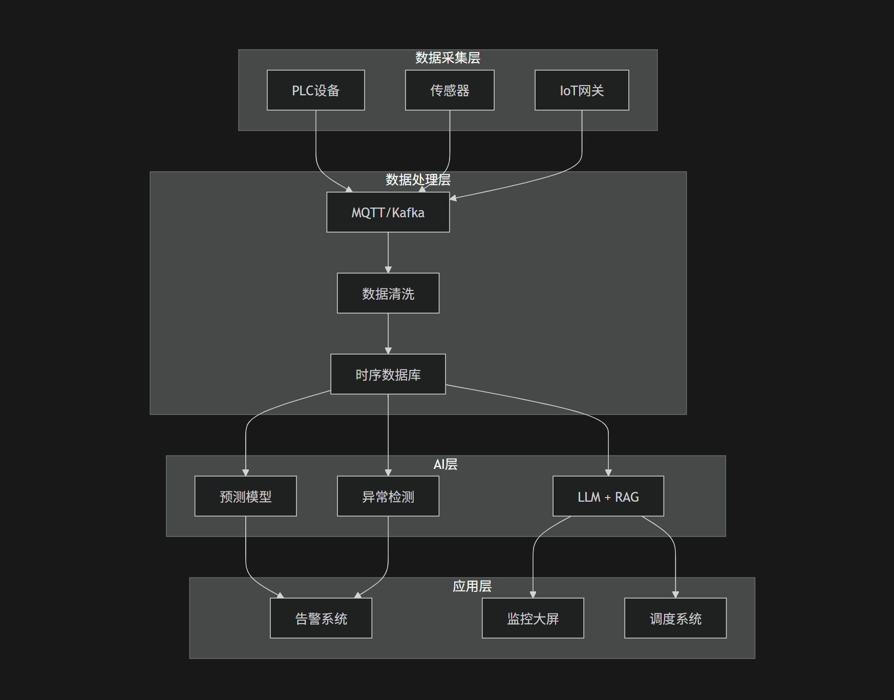

# 🚀 AI在工业项目中的应用

从“数据采集”到“智能决策”，AI正在成为工业系统的新操作系统。

## 一、为什么AI在工业场景更容易落地？

相比互联网，工业领域其实更适合AI落地，原因很现实：

---

### 1. 数据天然结构化

* 设备数据：温度 / 压力 / 电流 / 振动
* 通信协议：Modbus / OPC UA / S7
* 时间序列明显（非常适合建模）

👉 本质：工业数据“干净且稳定”

---

### 2. 业务规则明确

* 设备运行有标准区间
* 工艺流程固定
* 异常定义清晰（超限 / 波动异常）

👉 AI更多是增强规则，而不是替代规则

---

### 3. 投入产出比（ROI）清晰

* 停机 = 直接经济损失
* 人工巡检 = 成本高
* 能耗优化 = 立竿见影

👉 AI项目更容易“算清账”

---

## 二、AI在工业中的核心应用场景

---

### 1. 🔧 设备预测性维护

#### 传统模式

* 定期检修（浪费）
* 故障后维修（被动）

#### AI模式

* 基于历史数据预测设备健康状态
* 提前预警故障

#### 技术实现

* LSTM / Transformer（时间序列预测）
* 异常检测（Isolation Forest / AutoEncoder）

👉 从“报警系统”升级为“预测系统”

---

### 2. 👁️ 工业视觉（质检自动化）

#### 应用场景

* 缺陷检测（划痕 / 裂纹）
* OCR识别（二维码 / 标签）

#### 技术方案

* YOLO / CNN / SAM
* 边缘推理（Jetson / GPU）

👉 替代人工质检，提高一致性

---

### 3. 🚚 智能调度与路径优化

#### 场景

* 仓库路径规划
* AGV调度
* 生产排产优化

#### 技术组合

* A* / Dijkstra（路径规划）
* 强化学习（动态调度）
* 遗传算法（优化）

👉 AI负责“策略”，算法负责“执行”

---

### 4. ⚡ 能耗优化（最容易赚钱）

#### 应用

* 空压机 / 水泵调度
* HVAC系统优化
* 峰谷电策略

#### 方法

* 负载预测（回归模型）
* 自动调参

👉 很多项目ROI最高点

---

### 5. 🤖 工业知识问答（新趋势）

#### 应用

* 运维知识库
* 故障处理助手
* 操作指导系统

#### 技术方案（RAG架构）

👉 解决“老师傅经验无法复制”的问题

---

## 三、工业AI整体架构设计

一个完整的工业AI系统，一般分为四层：

---

### 🧱 1. 数据采集层

* PLC设备（西门子 / 三菱）
* IoT网关
* 协议接入（PLC4X / OPC UA）

👉 核心：统一设备数据模型

---

### ⚙️ 2. 数据处理层

* 消息流：Kafka / MQTT
* 时序数据库：InfluxDB / TDengine
* 数据清洗 + 特征工程

---

### 🧠 3. AI能力层

* 传统AI
* 预测模型（设备健康）
* 分类模型（故障识别）
* 大模型（LLM）
* 知识问答（RAG）
* 工单生成
* 运维助手

---

### 🖥️ 4. 应用层

* 监控大屏（3D工厂 / GIS）
* 告警系统
* 调度系统

---

### 📊 整体架构图

---

## 四、AI落地的四大难点（真实情况）

---

### 1. 数据质量问题（最大坑）

* 丢包
* 噪声
* 标注缺失

👉 80%的问题不是模型，而是数据

---

### 2. 模型泛化困难

* 不同设备差异大
* 工况复杂

👉 需要“规则 + AI”混合方案

---

### 3. 实时性要求高

* 工业系统不能延迟
* 需要边缘计算

---

### 4. 系统集成复杂

* 对接 MES / WMS / SCADA
* 老系统多

---

## 五、总结

AI在工业中的核心价值不是“炫技”，而是：
> 把经验数字化，把决策自动化

最终落地路径：

> 数据采集 → 数据治理 → AI建模 → 系统集成 → 业务闭环